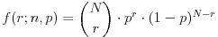
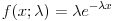

# JavaStat - A Statistics Library 
![alt text] (https://travis-ci.org/rbhadti94/JavaStat.svg?branch=master) 

* [Requirements](#requirements)
* [What is JavaStat?](#what-is-JavaStat?)
* [Using JavaStat](#using-JavaStat)
* [Library Functionalities](#library-functionalities)
  * [Basic Statistics](###basic-statistics)
  * [Probability Distribution Modelling](###probability-distribution-modelling)
  * [Parametric Data Modelling](###parametric-data-modelling)
* [Issues & Contact](#issues-&-contact)

## Requirements
The requirements are very minimal, you simply need the latest version of JDK (8.0 or above) installed.

**Linux**

The first option is to use the command line.
```
#Update and install JDK8
sudo apt-get update
sudo apt-get install openjdk-8-jdk

#Export PATH/Environment Variables
export JAVA_HOME=/usr/lib/jvm/java-8-openjdk
export PATH=$PATH:/usr/lib/jvm/java-8-openjdk/bin
```

The second option is to download the appropriate ```.deb``` package directly from the [Oracle Site](http://www.oracle.com/technetwork/java/javase/downloads/jdk8-downloads-2133151.html)

**Mac & Windows**

Navigate to [Oracle Site](http://www.oracle.com/technetwork/java/javase/downloads/jdk8-downloads-2133151.html) and download the appropriate package.

## What is JavaStat?
JavaStat is a multifunctional statistics library that allows users to carry out basic and advanced statistic calculations on 1D and 2D datasets.

This ranges from simple operations such as the mean & standard deviations to data-modelling operations such as linear regression.

## Using JavaStat
Head over the [Releases](https://github.com/rbhadti94/JavaStat/releases) section of the repository and download the latest stable release of this software.

## Library Functions


### Basic Statistics


### Probability Distribution Modelling
Probability distributions can be imported using:
```java
import JavaStat.statistics.Distributions
```
This contains


### Regression Analysis
The regression analysis can be imported using:
```
import JavaStat.statistics.Regression
```


**Pearson Correlation Coefficient**

**Spearman Rank Coefficient**

**Least Square Regression**


**Bionomial**                                                          
The bionomial distribution is modelled by the mathematical equation.



```java
//Returns a single probability value.
public static final double probBionomial(int r, int N, double p)

//Returns a distribution.
public static final double[] distBionomial(int N, double p)
```
**Exponential**                                             
The exponential distribution is modelled by the mathematical equation.



```java
//Returns P(X=x;lambda)
public static final double probExponential(double lambda, double x)

//Returns P(X=x;lambda) for all x in [0,N]
public static final double[] distExponential(double lambda, int xMax)
```

### Parametric Data Modelling


## Issues & Contact
I welcome any suggestions to how this library can be improved. Please let me know if:
* There's a mistake you find.
* A functionality is missing from the library.

Simply raise an issue in the **Issues** tab of the project and I will take a look as soon as I can.  
